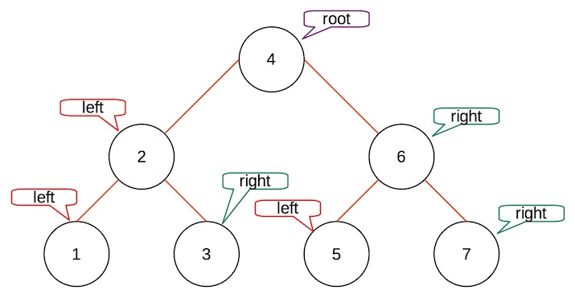

# Instructions:
Clone the repository
### To compile and run use: ./build.sh
### To remove class files from bin use: ./clean.sh
Once the GUI appears use the buttons or keyboard bindings to interact with the application.
1. Create a binary search tree
2. Add a node
3. Delete a node
4. Print nodes by InOrder
5. Print nodes by PreOrder
6. Print nodes by PostOrder
7. Exit program

# Assignment Specifications:

## 

## Assignment Prompt
The application must address the following requirements:

- Include a user interface allowing a user to interact with the binary search tree.
- When a user runs the application, it displays a menu and prompts the user to select an option.
- The menu options are:
1. Create a binary search tree  (@src/BST.java line 19)
2. Add a node   (@src/BST.java line: 39)
3. Delete a node    (@src/BST.java line: 52)
4. Print nodes by InOrder   (@src/BST.java line: 95)
5. Print nodes by PreOrder  (@src/BST.java line: 114)
6. Print nodes by PostOrder    (@src/BST.java line: 133)
7. Exit program    (@src/Main.java line: 265)
- When a user selects (1) Create a binary search tree, the application creates a binary search tree with the given data (1, 2, 3, 4, 5, 6, 7). To keep the binary search tree balanced at all times, follow these rules: 
- (1) the child nodes on the left must have a search key value less than that of the root node and 
- (2) the child nodes on the right must have search key values greater than that of the root node.
The given numbers must be assigned as shown in the figure below.

- When a user selects (2) Add a node, the application prompts the user to input a value for the new node. The application needs to insert the value to the existing binary search tree.

- When a user selects (3) Delete a node, the application prompts the user to input the value of the node that will be deleted. The application needs to delete the node.

- When a user selects (4) Print nodes by InOrder, the application prints the nodes of the current binary search tree by traversing it using in-order traversal.

- When a user selects (5) Print nodes by PreOrder, the application prints the nodes of the current binary search tree by traversing it using pre-order traversal.

- When a user selects (6) Print nodes by PostOrder, the application prints the nodes of the current binary search tree by traversing it using post-order traversal.

- When a user selects (7) Exit program, the application ends.